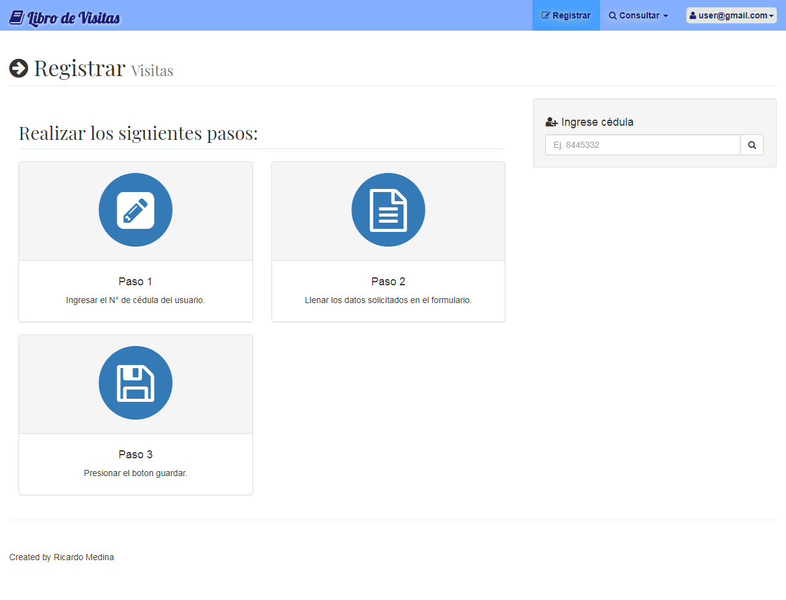
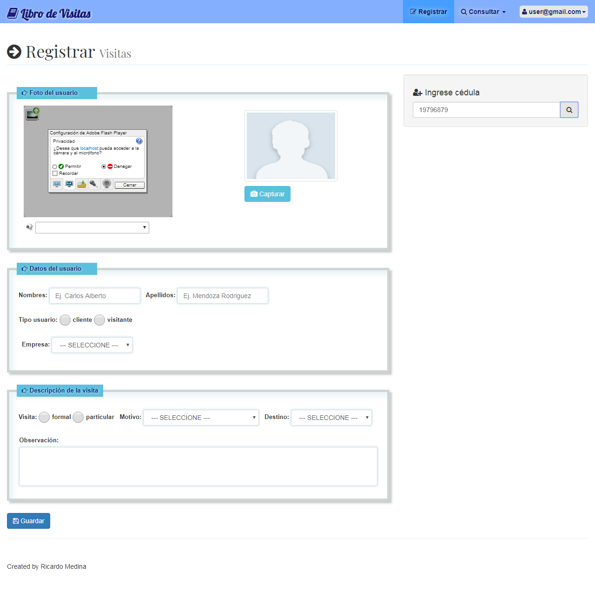

# Proyecto personal: App libro de visitas

> Este repositorio contiene una aplicación web sencilla que permite llevar el control de las personas que ingresan a un edifico, empresa, etc. Guardando sus datos personales, descripción de la visita y capturando un foto de la persona con la web cam. Fue desarrollada con el Framework Web Laravel 5.2





## Quick Start

Requiere PHP version between 5.5.9 - 7.1.*

``` bash
# Install Dependencies
composer install

# Run Migrations
php artisan migrate

# Run Seeders
php artisan db:seed

# Start up the php server
php artisan serve

# Test
admin: admin@gmail.com
user: user@gmail.com
password: 1234

# If you get an error about an encryption key
php artisan key:generate

```
## Licencia 

MIT